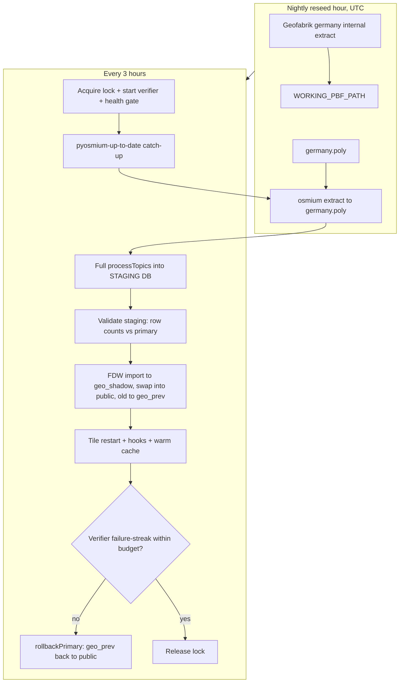

# OSM Red/Green Update Pipeline

How TILDA refreshes Germany OSM data every few hours without taking the live
site offline, and how to operate and debug it.

This is the single source of truth for the red/green pipeline. Code lives in
[`processing/redGreen/`](../processing/redGreen/); a short pointer is in
[`processing/redGreen/README.md`](../processing/redGreen/README.md).

---

## Goal

Rebuild the full Germany dataset on a ~3-hour cadence, **in an isolated staging
database**, validate it against the live data, then **promote** it into the
fixed primary database with minimal interruption — and roll back automatically
if serving health degrades. App/user data (the `prisma` schema) is never touched.

This is the "blue/green" idea applied to geo data: build green off to the side,
flip traffic only after green checks out, keep blue (`geo_prev`) for rollback.

---

## How it works



Entry point (run from `processing/`):

```sh
bun run red-green        # = bun ./redGreen/orchestrate.ts
```

### Stage-by-stage

| Stage            | Module                                           | What it does                                                                                                                                                                                                                                                                                                                                                                                                                                                                                                                                                                                                                             |
| ---------------- | ------------------------------------------------ | ---------------------------------------------------------------------------------------------------------------------------------------------------------------------------------------------------------------------------------------------------------------------------------------------------------------------------------------------------------------------------------------------------------------------------------------------------------------------------------------------------------------------------------------------------------------------------------------------------------------------------------------- |
| Lock + verify    | `lock.ts`, `verifier.ts`, `orchestrate.ts`       | Acquire a single-run lock (auto-breaks if older than `RED_GREEN_LOCK_TTL_SECONDS`). Start the continuous health verifier. Hard-gate on `RED_GREEN_VERIFY_ENDPOINTS` being reachable.                                                                                                                                                                                                                                                                                                                                                                                                                                                     |
| Baseline         | `downloadBaseline.ts`                            | Nightly (at `RED_GREEN_RESEED_UTC_HOUR`, or when missing / `RED_GREEN_FORCE_RESEED=1`): redownload the Geofabrik internal extract to `WORKING_PBF_PATH`, and bootstrap `RECUT_POLYGON_PATH` from `RECUT_POLYGON_DOWNLOAD_URL`. Otherwise keep the working PBF for intra-day catch-up.                                                                                                                                                                                                                                                                                                                                                    |
| Catch-up + recut | `replicateAndRecut.ts`                           | `pyosmium-up-to-date` brings the working PBF current (with `--ignore-osmosis-headers` when `REPLICATION_SERVER_URL` overrides the baked-in feed; it retries only while pyosmium exits `1`, any other non-zero exit fails the run). Then `osmium extract --strategy complete_ways --polygon` (or `--bbox`) clips to Germany — `complete_ways` keeps border-crossing ways whole, which is the mechanism behind the "approximate at borders" caveat. Writes a checkpoint to `/data/hashes/red_green_replication_<runId>.json`.                                                                                                              |
| Staging build    | `stagingBuild.ts`                                | `withProcessEnv(dbEnv(staging))` sets `PG*` so `psql`/`Bun.sql` connect to the staging DB (`params` itself holds no DB target), then runs the normal `processTopics()` full rebuild plus `runAfterthoughts()` there. The live primary is never written during the build.                                                                                                                                                                                                                                                                                                                                                                 |
| Validate         | `validateStaging.ts`, `promotableTables.ts`      | Discover promotable `public.*` `BASE TABLE`s (excludes `*_diff`, skip-list `spatial_ref_sys` / `meta` / `todos_lines_campaign_stats`, honors `PROMOTION_TABLES_ALLOWLIST`). Require `meta` rows, reject zero-row **non-intermediate** tables (intermediate = name starting with `_`), and require each table's staging row count to be within `PROMOTION_ROW_COUNT_TOLERANCE` of primary.                                                                                                                                                                                                                                                |
| Promote          | `promotePrimary.ts`                              | Via `postgres_fdw`: create a `geo_stage_server_<runId>` server + user mapping to staging, `IMPORT FOREIGN SCHEMA` into `geo_stage_import`, copy each table into `geo_shadow` (per-table, **outside** a transaction), then **one** transaction swaps `public.*` → `geo_prev.*` and `geo_shadow.*` → `public.*`, then drops the import schema + FDW server (cleanup failures only warn). The denylist blocks app/user tables — the Prisma table names (they live in schema `prisma`, so this is belt-and-braces) plus the `prisma_*` pattern; the skip-list keeps `spatial_ref_sys`, `meta`, `todos_lines_campaign_stats` out of the swap. |
| Post-promotion   | `orchestrate.ts`, `../steps/externalTriggers.ts` | Re-check endpoints, restart the tiles container, trigger `post-processing-hook` / `post-processing-qa-update`, clear the nginx proxy cache, warm the cache (`full` or `delta`). These retry transient failures and **warn (do not roll back)** on persistent ones.                                                                                                                                                                                                                                                                                                                                                                       |
| Gate / rollback  | `verifier.ts`, `rollbackPrimary.ts`              | At the end, if the verifier's max failure streak exceeded `RED_GREEN_MAX_FAILURE_STREAK`, fail the run and `rollbackPrimary` swaps `geo_prev` back into `public`. Rollback only applies once the swap transaction committed — before that, `public.*` is untouched (`geo_prev` may be empty). The lock is always released in `finally`.                                                                                                                                                                                                                                                                                                  |

**Only the verifier budget rolls back a promotion.** A flaky tile restart or
warm-cache does not — the data already validated and promoted cleanly, and the
verifier is the real "is serving healthy" signal.

---

## Environment variables

Required:

| Var                               | Purpose                                                                                       |
| --------------------------------- | --------------------------------------------------------------------------------------------- |
| `PROCESSING_STAGING_DATABASE_URL` | Writable secondary DB the build targets.                                                      |
| `PROMOTION_PRIMARY_DATABASE_URL`  | Fixed primary DB that receives promoted geo tables.                                           |
| `RED_GREEN_VERIFY_ENDPOINTS`      | Comma-separated health URLs probed before/after promotion. The run refuses to start if unset. |

Replication / recut:

| Var                              | Default                                  | Purpose                                                                                                                                                          |
| -------------------------------- | ---------------------------------------- | ---------------------------------------------------------------------------------------------------------------------------------------------------------------- |
| `WORKING_PBF_PATH`               | `/data/downloads/germany-latest.osm.pbf` | Baseline PBF reseeded nightly + caught up intra-day.                                                                                                             |
| `RECUT_PBF_PATH`                 | `/data/filtered/germany-recut.osm.pbf`   | Output of the Germany recut.                                                                                                                                     |
| `RECUT_POLYGON_PATH`             | —                                        | Clip polygon (preferred). When set, the file is required (bootstrapped if missing).                                                                              |
| `RECUT_POLYGON_DOWNLOAD_URL`     | —                                        | URL to bootstrap the polygon, e.g. `https://download.geofabrik.de/europe/germany.poly`.                                                                          |
| `RECUT_BBOX`                     | —                                        | Bbox fallback when no polygon is set (dev/smoke only).                                                                                                           |
| `REPLICATION_SERVER_URL`         | — (baked-in headers)                     | Intra-day feed. Planet hourly: `https://planet.osm.org/replication/hour/`. OSM-fr Germany: `https://download.openstreetmap.fr/replication/europe/germany/hour/`. |
| `REPLICATION_LOOP_SLEEP_SECONDS` | `60`                                     | Sleep between pyosmium catch-up retries.                                                                                                                         |
| `RED_GREEN_RESEED_UTC_HOUR`      | `0`                                      | Nightly Geofabrik reseed hour.                                                                                                                                   |
| `RED_GREEN_FORCE_RESEED`         | —                                        | `1` forces a reseed + polygon refresh next run.                                                                                                                  |

Promotion / safety / cache:

| Var                             | Default              | Purpose                                                                                                      |
| ------------------------------- | -------------------- | ------------------------------------------------------------------------------------------------------------ |
| `PROMOTION_TABLES_ALLOWLIST`    | —                    | Comma-separated promote list (empty = auto-discover).                                                        |
| `PROMOTION_ROW_COUNT_TOLERANCE` | `0.15`               | Max relative row-count delta vs primary before promotion.                                                    |
| `RED_GREEN_VERIFY_INTERVAL_MS`  | `5000`               | Verifier polling interval.                                                                                   |
| `RED_GREEN_MAX_FAILURE_STREAK`  | `3`                  | Max consecutive failed probes before the run fails (and rolls back if already promoted).                     |
| `RED_GREEN_LOCK_TTL_SECONDS`    | `14400` (4h)         | A lock older than this is treated as a crashed run and broken.                                               |
| `WARM_CACHE_MODE`               | `full`               | `full` or `delta`.                                                                                           |
| `RED_GREEN_DELTA_WARM_ENDPOINT` | —                    | Private endpoint used when `WARM_CACHE_MODE=delta`.                                                          |
| `ATLAS_API_KEY`                 | —                    | Used to call the private post-processing/warm hooks.                                                         |
| `RED_GREEN_RUN_ID`              | auto (UTC timestamp) | Override the run id used in artifact filenames and the FDW server name — handy to correlate a manual re-run. |

All of these are wired through `docker-compose.yml` and declared in
[`.github/env/deploy.manifest.json`](../.github/env/deploy.manifest.json) so
`setup-env` renders them into the on-VPS `.env`.

---

## Operations

### Scheduling

`generate-tiles.staging.yml` runs every 3 hours (`0 */3 * * *`) with
`PIPELINE: red-green`. `generate-tiles.production.yml` stays on the legacy daily
in-place run until the staging soak passed (rollout status:
[`osm-red-green-status-2026-09.md`](osm-red-green-status-2026-09.md)); switching
it is a two-line change (`PIPELINE: red-green` + the 3h cron). The reusable
`generate-tiles.yml` runs `docker compose run --rm processing bun run red-green`
over SSH, guarded by a `concurrency` group per environment so a run that exceeds
3h makes the next one wait instead of overlapping.

### `processing` is an on-demand worker, not a service (red/green environments)

On a red/green environment do **not** `docker compose up -d processing`. The
container only runs per-invocation via `docker compose run --rm processing …`.
`deploy-processing.yml` therefore only _pulls_ the new image there
(`START_PROCESSING_ON_DEPLOY: false`, set in `deploy.staging.yml`) — starting the
container would launch the legacy in-place `index.ts` against the primary DB on
every deploy and race the red/green run. Legacy environments keep the
start-on-deploy behavior (input default `true`).

### Nightly reseed vs intra-day freshness

The nightly Geofabrik reseed is the correctness anchor: it resets any drift/bloat
from applying diffs to a clipped extract. Intra-day catch-up + recut is
deliberately _approximate at borders_ between reseeds — acceptable because the
next reseed corrects it.

---

## Debugging

### Where to look (all under the `osmfiles` volume, `/data/hashes/`)

| Artifact                             | Tells you                                                                                                                                                                                                                                                                                                  |
| ------------------------------------ | ---------------------------------------------------------------------------------------------------------------------------------------------------------------------------------------------------------------------------------------------------------------------------------------------------------- |
| `red_green_pipeline.lock`            | A run is active (or crashed — see stale lock below). Contains `pid timestamp`.                                                                                                                                                                                                                             |
| `red_green_verify_<runId>.jsonl`     | Per-probe health timeline (`ts, endpoint, ok, status, durationMs`). `status: 0` = a connection/fetch exception, not an HTTP status. The rollback gate is the **max consecutive `ok:false` streak** vs `RED_GREEN_MAX_FAILURE_STREAK` — the streak is not stored, reconstruct it from consecutive failures. |
| `red_green_replication_<runId>.json` | Working PBF size + mtime after catch-up — watch for monotonic bloat between reseeds.                                                                                                                                                                                                                       |
| `red_green_last_reseed`              | Date of the last Geofabrik reseed.                                                                                                                                                                                                                                                                         |

Container logs: `docker compose run` prints the orchestrator log; each shell
command is echoed with a `🔧` prefix. Set `RED_GREEN_RUN_ID` to pin the `<runId>`
suffix (and the FDW server name) when correlating a manual re-run to its artifacts.

The lock is released in a `finally`, but a **hard kill** (OOM, `docker kill`, host
reboot) skips it — which is exactly why the TTL auto-break exists. A leftover lock
after a crash is expected, not a bug.

### Common failures

| Symptom                                                                                  | Likely cause / fix                                                                                                                                                                                                                                                                            |
| ---------------------------------------------------------------------------------------- | --------------------------------------------------------------------------------------------------------------------------------------------------------------------------------------------------------------------------------------------------------------------------------------------- |
| `Another run is already active (lock …)` and no run is running                           | Crashed run left the lock. It auto-breaks after `RED_GREEN_LOCK_TTL_SECONDS`; to clear now, delete `/data/hashes/red_green_pipeline.lock`.                                                                                                                                                    |
| `RED_GREEN_VERIFY_ENDPOINTS must be set`                                                 | The env var is missing; the run refuses to start without health endpoints.                                                                                                                                                                                                                    |
| `Validation failed: public.X has zero rows` / `…% delta … tolerance …`                   | Staging build is incomplete or the dataset genuinely shrank/grew beyond tolerance. Inspect the staging DB; raise `PROMOTION_ROW_COUNT_TOLERANCE` only if the change is expected.                                                                                                              |
| `RECUT_POLYGON_PATH … but the file does not exist`                                       | Set `RECUT_POLYGON_DOWNLOAD_URL` (so it bootstraps) or unset `RECUT_POLYGON_PATH` to fall back to `RECUT_BBOX`.                                                                                                                                                                               |
| `pyosmium-up-to-date failed`                                                             | Network/feed issue, or switching feeds without `--ignore-osmosis-headers` (set automatically when `REPLICATION_SERVER_URL` is set).                                                                                                                                                           |
| `psql: command not found`                                                                | `postgresql-client` missing from the image — it is installed explicitly in `processing.Dockerfile`; rebuild the image.                                                                                                                                                                        |
| `could not connect to server` / `password authentication failed` during promote          | FDW failure: primary can't reach the staging host, `pg_hba.conf`/credentials reject the user mapping, or `postgres_fdw` couldn't be created (needs sufficient privileges). Confirm primary→staging connectivity and that `PROCESSING_STAGING_DATABASE_URL` credentials work from the primary. |
| Leftover `geo_shadow` / `geo_stage_import` schemas or `geo_stage_server_*` after a crash | The per-table FDW copy runs outside a transaction, so a crash mid-promote skips the end-of-run cleanup. Safe to drop manually before the next run (see "Recovering from a crashed promotion" below).                                                                                          |
| Tile `/catalog` stale after a run                                                        | Tile restart warned but didn't fail the run (by design — it does not roll back). Cause is usually a missing `/var/run/docker.sock` mount or no `docker` CLI in the image. Restart the `tiles` container manually.                                                                             |

### Manual rollback

If a promotion went bad and the automatic rollback didn't fire, the previous geo
tables are still in `geo_prev` (kept until the next run overwrites them). Swap
them back on primary:

```sql
BEGIN;
  DROP TABLE IF EXISTS public."<table>" CASCADE;
  ALTER TABLE IF EXISTS geo_prev."<table>" SET SCHEMA public;
COMMIT;
```

### Recovering from a crashed promotion

The per-table FDW copy loop runs statement-by-statement _outside_ a transaction
(only the final schema swap is transactional). A crash mid-promote can therefore
leave a half-populated `geo_shadow`, the `geo_stage_import` foreign schema, and a
`geo_stage_server_<runId>` FDW server behind. `public.*` is untouched until the
swap transaction, so the live site is fine — just clean up the leftovers on
primary before the next run:

```sql
DROP SCHEMA IF EXISTS geo_stage_import CASCADE;
DROP SCHEMA IF EXISTS geo_shadow CASCADE;
-- list and drop any leftover per-run FDW servers:
SELECT srvname FROM pg_foreign_server WHERE srvname LIKE 'geo_stage_server_%';
DROP SERVER IF EXISTS "geo_stage_server_<runId>" CASCADE;
```

### Running locally

Build in a throwaway `staging` database on the existing dev `db` container,
scope it down, and point verify endpoints at the dev ports:

```sh
PROCESSING_STAGING_DATABASE_URL=postgresql://…@db:5432/staging \
PROMOTION_PRIMARY_DATABASE_URL=postgresql://…@db:5432/postgres \
RECUT_BBOX=… PROCESS_ONLY_TOPICS=parking \
RED_GREEN_VERIFY_ENDPOINTS=http://127.0.0.1:4000/,http://127.0.0.1:3000/catalog \
bun run red-green
```

In dev (`VITE_APP_ENV=development`) the post-processing hooks and warm-cache are
**no-ops** — `triggerPrivateApi` just prints the `curl` command instead of calling
it. In production a hung hook retries connection errors up to ~10× at 1-minute
intervals (15-minute per-attempt timeout), so a stuck hook can quietly add many
minutes to a run — worth checking first if a run is mysteriously slow.

---

## Design decisions (why this shape)

**Option B was chosen:** Geofabrik nightly baseline → planet/region hourly
catch-up via `pyosmium-up-to-date` → `osmium` recut → full staging build → FDW
promotion. It is the simplest approach that fits TILDA's hard constraints (fixed
primary DB URL, `prisma`/user data must not move, full-rebuild topic pipeline,
Geofabrik _internal_ OAuth baseline with full metadata).

Rejected alternatives:

- **osm2pgsql `--append` (minutely DB updates):** wrong model — the topic
  pipeline assumes clean `--create` full rebuilds; hard to validate/rollback.
- **praszuk planet-minute poly-filter + append:** heavy (Python poly filter,
  append mode); useful only as a reference for regional diff filtering.
- **Re-download Geofabrik every 3h:** simple but wasteful bandwidth; daily-max
  freshness anyway.

Open caveats to validate during battle-testing (these are not yet settled):

1. **Replication source.** Planet hourly carries full metadata but applies
   _global_ diffs to a Germany file (bloat until the nightly reseed). The OSM-fr
   Germany feed is pre-clipped (no bloat) and `pyosmium-up-to-date --server …`
   consumes it directly — worth A/B-testing against the Geofabrik-internal
   baseline for polygon/metadata alignment.
2. **FDW full-copy cost.** Promotion copies every promoted table's full contents
   through `postgres_fdw` and rebuilds indexes on primary _every run_. At Germany
   scale this can dominate the 3h budget; if it does, switch to
   `pg_dump | pg_restore` of the staging schema into the shadow schema.
3. **Intra-day border accuracy** is approximate by design; the nightly reseed is
   the correctness guarantee.

---

## Production-readiness checklist (operator tasks)

Code/CI in this repo is ready; the following require infra/secrets and battle
testing and are **not** done by the code change alone:

- [ ] Provision a writable `staging` database reachable from the processing
      container on **each** VPS (staging + production), and confirm the primary
      can reach the staging host for FDW (Docker network / `pg_hba.conf`).
- [ ] Set the red/green GitHub **environment** secrets/vars (the keys are in
      `deploy.manifest.json`, all `required:false` until provisioned):
      `PROCESSING_STAGING_DATABASE_URL`, `PROMOTION_PRIMARY_DATABASE_URL`,
      `RED_GREEN_VERIFY_ENDPOINTS`, `WORKING_PBF_PATH`, `RECUT_*`,
      `REPLICATION_SERVER_URL`, `RED_GREEN_RESEED_UTC_HOUR`, …
- [ ] Ensure **100+ GB free** on the processing host (working PBF, recut,
      staging DB, processing temps).
- [ ] Battle-test on **staging first**: component smoke → small-bbox E2E with a
      promotion + rollback drill → full Germany run (measure wall time, peak
      disk, FDW copy duration) → 72h soak on the 3h cron → failure injection.
- [ ] Production canary: one manual `workflow_dispatch` Germany run, then rely on
      the 3h cron. Review `/data/hashes/red_green_*` for the first week.
- [ ] Configure a disk-free alarm and GHA failure notifications.
